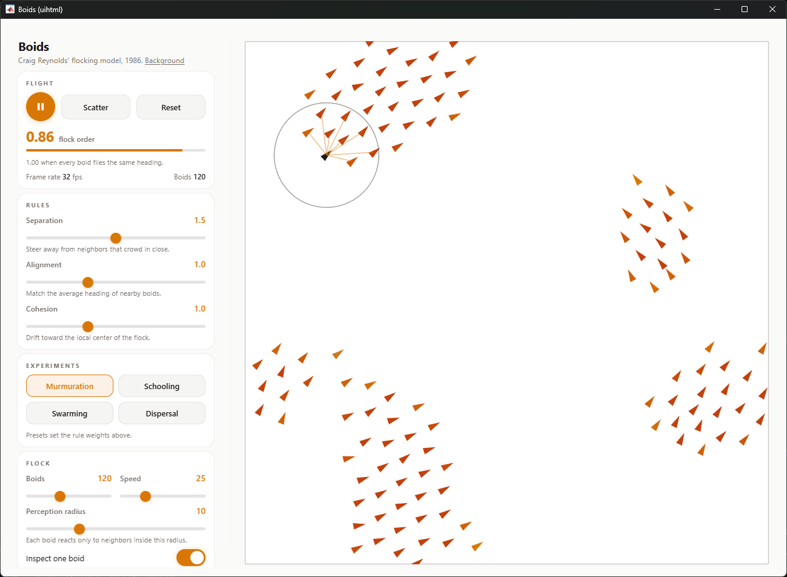

# Boids: flocking from three rules

An interactive [Boids](https://en.wikipedia.org/wiki/Boids) simulator for learning how flocks work, built with the two MATLAB uihtml skills in this repo:

- [`matlab-uihtml-app-builder`](../../skills/matlab-uihtml-app-builder/SKILL.md): architecture, event wiring, MATLAB to JS communication
- [`matlab-uihtml-design`](../../skills/matlab-uihtml-design/SKILL.md): Warm Dark visual style

The control panel is HTML/CSS/JS embedded via `uihtml`.
The simulation and rendering are native MATLAB: a `timer` steps the flock at 30 fps and draws it as oriented triangles on a `uiaxes`.



Every style in `matlab-uihtml-design` defines both a dark and a light mode, and the app follows the MATLAB desktop theme.
The screenshot shows Warm Dark's light variant; on a dark desktop the panel and sky switch to warm gray with amber accents.

## The idea

In 1986, Craig Reynolds built a computer model of coordinated animal motion around one observation: a flock needs no leader, no choreography, and no global plan.
It only needs each individual (each *boid*, short for "bird-oid object") to follow three rules based on the neighbors it can see:

1. **Separation**: steer away from neighbors that crowd in close.
2. **Alignment**: match the average heading of nearby boids.
3. **Cohesion**: drift toward the local center of the flock.

That is the whole model.
Nothing in the rules says "form a flock", yet flocks form, split, and rejoin, like starling murmurations at dusk.
Behavior that appears at the group level without being written into the individual rules is called *emergence*, and Boids is the classic demonstration.

This app lets you experiment with the machinery directly.
Each rule has a weight slider that acts on the live flock.
A **flock order** readout quantifies how organized the group is, and an inspect mode shows the world from a single boid's point of view.

## The model

The flock lives on a 100 x 100 wrap-around world (a torus), so there are no walls to confound the behavior.
All pairwise offsets are computed on the torus: `d = d - L*round(d/L)` maps each offset into `[-L/2, L/2]`.

Each boid sees only neighbors within the **perception radius** `r`.
Per tick, each rule produces a Reynolds steering force from a desired direction:

```
F = clip(vmax * unit(desired) - v,  fmax)
```

where `fmax = 4*vmax*dt` caps the turn rate.
The three desired directions are:

- **Separation**: away from neighbors inside an inner zone of `0.45*r`, weighted by `1/d^2` so the closest neighbor dominates.
- **Alignment**: the mean velocity of visible neighbors.
- **Cohesion**: toward the mean position of visible neighbors.

The weighted sum `w_sep*F_sep + w_ali*F_ali + w_coh*F_coh` updates the velocity, speed is clamped to `[0.5*vmax, vmax]` (real birds cannot hover), and positions integrate with the measured wall-clock `dt`, so on-screen speed matches the Speed setting regardless of frame rate.

Two refinements keep the model honest at extreme slider settings:

- **Arrival and crowding damping on cohesion.** The pull toward the local center fades as the center gets close and as the immediate neighborhood fills up. Without this, high cohesion with low separation pumps every boid toward one point.
- **A contact core.** Boids closer than 1.2 units are treated as colliding: the approach velocity toward the nearest neighbor is removed and overlaps are relaxed apart positionally, one Jacobi iteration per tick. Steering alone cannot resolve a dense clump because the away-from-everyone contributions cancel.

The **flock order** readout is the standard polarization order parameter from statistical physics (used in the Vicsek model of collective motion):

```
order = | mean over boids of v_i / |v_i| |
```

It is 1.0 when every boid flies the same heading and near 0 for random headings.
The experiments below use it to measure what each slider does.

The math is vectorized over all boid pairs (an N x N computation per tick), which sustains 300 boids at 30 fps without spatial data structures.

## Run it

Requires MATLAB R2021a or newer (R2025a+ for automatic light/dark theme sync).

```matlab
cd agent-skills-playground/demos/boids-uihtml-app
boidsGUI
```

The flock starts flying immediately.

## Learn by experiment

Each experiment takes under a minute.
Watch the sky and the flock order value.

1. **Watch order emerge.**
   Press Reset with the Murmuration preset active.
   The flock starts at order near 0 (random headings) and climbs above 0.9 as local rules propagate agreement across the flock.
   No boid decided the final direction; the flock did.

2. **Remove alignment.**
   Drag Alignment to 0 (or use the Swarming preset).
   Cohesion still holds groups together, but order collapses: boids mill around shifting centers like a cloud of gnats.
   Alignment is the rule that turns a swarm into a flock.

3. **Remove cohesion.**
   Use the Dispersal preset (separation high, cohesion 0).
   The flock evaporates into a uniform gas that fills the world.
   Cohesion is what makes a group exist at all.

4. **Shrink the world each boid can see.**
   Back on Murmuration, drag Perception radius down to 3: the flock fragments into many small groups that ignore each other.
   Raise it to 25 and the fragments fuse into one consensus flock.
   Group size is set by information range, not by any group-size rule.

5. **See what one boid sees.**
   Turn on "Inspect one boid".
   The ring is that boid's entire world: it reacts only to the neighbors linked inside it.
   Everything else in this demo follows from that limited view.

6. **Strike like a predator.**
   Press Scatter, or click anywhere in the sky.
   Boids flee the strike point, order dips, and the flock re-forms within seconds.
   Resilience without a leader: there is no one to kill.

Then take it further.
How high must alignment be to reach order 0.99?
Does a faster flock (Speed 60) need a larger perception radius to stay coherent?

## How it works

The HTML panel and MATLAB communicate through `uihtml` events.
Rule sliders act on the running simulation: the JS side throttles slider input to about 12 events per second, and the MATLAB side validates every value against its allowed range.

| Event | Direction | Payload |
|---|---|---|
| `Ready`      | JS to MATLAB | `""` (panel loaded; MATLAB replies with theme and starts the flock) |
| `Start` / `Pause` | JS to MATLAB | `""` |
| `Reset`      | JS to MATLAB | `""` (re-seed positions, keep parameters) |
| `SetParams`  | JS to MATLAB | `{sep, ali, coh, radius, speed}` applied live |
| `SetCount`   | JS to MATLAB | integer; boids are added or removed without a restart |
| `SetInspect` | JS to MATLAB | boolean |
| `Scatter`    | JS to MATLAB | `""` (predator strike at the flock's circular-mean center) |
| `OpenLink`   | JS to MATLAB | URL string; uihtml blocks `target="_blank"`, so MATLAB opens the system browser via `web` |
| `SimState`   | MATLAB to JS | `{running}` keeps the play/pause button honest |
| `Stats`      | MATLAB to JS | `{order, fps, n}` at 5 Hz |
| `SetTheme`   | MATLAB to JS | `{theme: "dark" \| "light"}` |
| `SimError`   | MATLAB to JS | error message string |

Boids are colored by local density: lone boids in warm gray, crowded boids ramping from amber to orange, so flock structure is visible at a glance.

## Credits

- Craig W. Reynolds, "Flocks, Herds, and Schools: A Distributed Behavioral Model", *SIGGRAPH '87*.
- [Boids on Wikipedia](https://en.wikipedia.org/wiki/Boids).
- Order parameter from T. Vicsek et al., "Novel Type of Phase Transition in a System of Self-Driven Particles", *Phys. Rev. Lett.* 75, 1226 (1995).
