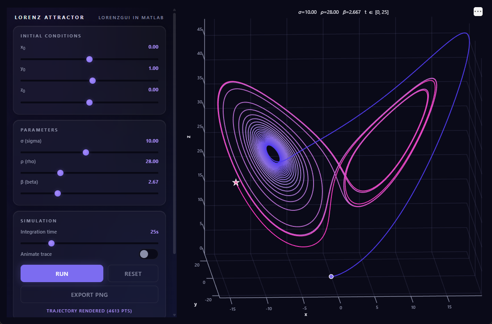

# Lorenz Attractor: a MATLAB uihtml demo

An interactive Lorenz-system explorer built with the two MATLAB uihtml skills in this repo:

- [`matlab-uihtml-app-builder`](../../skills/matlab-uihtml-app-builder/SKILL.md): architecture, event wiring, MATLAB ↔ JS communication
- [`matlab-uihtml-design`](../../skills/matlab-uihtml-design/SKILL.md): Cosmic Dark visual style

The control panel is HTML/CSS/JS embedded via `uihtml`. The 3D plot is a native MATLAB `uiaxes`. Inspired by Cleve Moler's `lorenzgui` from *Numerical Computing with MATLAB*.



The screenshot shows the default parameters (σ=10, ρ=28, β=8/3) after one Run: the classic butterfly, colored from indigo to magenta along the trajectory.

## What you can do

- Pick initial conditions `x₀, y₀, z₀` with sliders
- Tune the Lorenz parameters `σ, ρ, β`
- Choose the integration end time
- Run `ode45`, see the trajectory in 3D (time-colored), rotate with the mouse
- Toggle **Animate trace** to watch the curve draw progressively; drag the **Speed** slider while it's animating to change the rate live
- The **Run** button turns into **Stop** during animation; click to halt and keep the partial trace
- **Export PNG** of the current plot at 300 dpi
- Read back point count, final state, and elapsed time in the *Last Result* panel

## Requirements

MATLAB R2021a or newer (R2025a+ for automatic light/dark theme sync)

## Run it

From the MATLAB prompt:

```matlab
cd C:\github\agent-skills-playground\demos\lorenz-uihtml-app
lorenzGUI
```

Then press **Run** in the control panel.

## How it works

| Event | Direction | Payload |
|---|---|---|
| `RunSimulation` | JS → MATLAB | `{x0, y0, z0, sigma, rho, beta, tEnd, animate, speed}` |
| `Reset`         | JS → MATLAB | `""` (also stops a running animation timer) |
| `StopAnimation` | JS → MATLAB | `""` (halts animation, preserves partial trace) |
| `ExportImage`   | JS → MATLAB | `""` (opens a `uiputfile` dialog) |
| `SetSpeed`      | JS → MATLAB | integer pts/frame. Adjusts speed of a running animation live (no-op if idle) |
| `OpenLink`      | JS → MATLAB | URL string; uihtml blocks `target="_blank"`, so MATLAB opens the system browser via `web` |
| `SimComplete`   | MATLAB → JS | `{nPoints, finalX, finalY, finalZ, elapsedMs}` |
| `SimStopped`    | MATLAB → JS | `{nPoints, finalX, finalY, finalZ, elapsedMs}` for the partial trace at stop |
| `SimError`      | MATLAB → JS | error message string |
| `ExportComplete`| MATLAB → JS | filename written, or `"cancelled"` |
| `ExportError`   | MATLAB → JS | error message string |
| `SetTheme`      | MATLAB → JS | `{theme: "dark" \| "light"}` |

The Lorenz system:

```
dx/dt = σ (y - x)
dy/dt = x (ρ - z) - y
dz/dt = x y - β z
```

Default parameters (`σ=10, ρ=28, β=8/3`) reproduce the classic butterfly attractor.